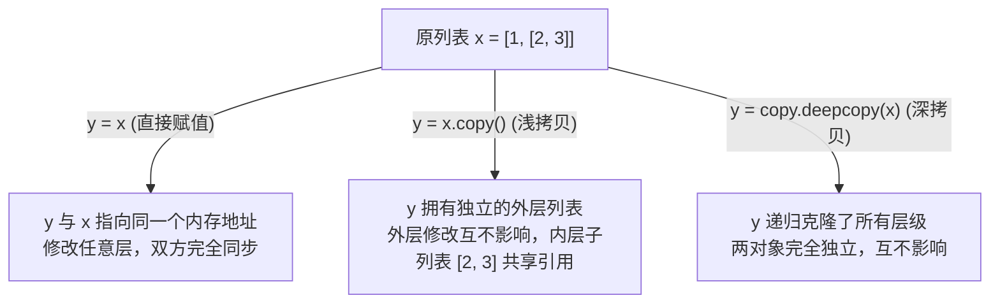

# 4.1 列表基础与常用方法

[🏠 知识总索引](../00-INDEX.md) | [⬅️ 上一节：4.0 可迭代对象与迭代器总览](01-可迭代对象与迭代器总览.md) | [下一节：4.1.4 列表支持的运算符 ➡️](03-列表支持的运算符.md)

---

> [!TIP]
> **30秒速记卡**
> - **底层架构**：连续内存空间，内部存储的是**对象的引用（指针）**；尾部增删快，头/中部增删需批量移动元素开销大。
> - **添加三剑客**：`append(obj)` 整包塞入（长+1）；`extend(iter)` 拆包倒入（长+N）；`insert(i, obj)` 指定位置插入。**均为原地操作，返回 None**。
> - **删除四门派**：`pop(index)` 按位置弹出（**有返回值**）；`remove(val)` 按值删首个（**无返回值**，不存在报 ValueError）；`del lst[i]` 语句删除；`clear()` 原地清空。
> - **查与统**：`count(val)` 计数（不存在返回 0）；`index(val)` 找下标（不存在报 ValueError）；`in` 运算符复杂度 $O(n)$。
> - **排与逆**：`lst.sort()` 原地修改（返回 None）；`sorted(lst)` 不改原列表（返回新列表）；`lst.reverse()` 原地翻转。
> - **拷贝三层次**：`y = x` 同一对象起外号；`y = x.copy()` 浅拷贝（外壳独立，内层子列表共享）；`y = copy.deepcopy(x)` 深拷贝（完全独立克隆）。

**标签**：`#Python` `#列表` `#原地操作` `#深浅拷贝` `#sort_vs_sorted`

---

## 一、底层内存机制与基本操作

1. **基于引用的内存管理**：
   - 列表元素不是直接存储数据值本身，而是存储各个对象的引用（内存地址）。
   - 因此列表内可以随意混合存放整数、浮点数、字符串、元组或列表。
2. **转换陷阱**：
   - `list({'a': 1, 'b': 2})` 默认仅提取字典的 **`Key`**，得到 `['a', 'b']`。
   - 提取完整键值对需使用 `list(dict.items())`。
3. **双向索引**：
   - 正向从 `0` 到 `n - 1`；反向从 `-1` 到 `-n`。
   - 下标赋值只能修改已有位置，**无法通过越界索引赋值来实现自动扩容**（会报 `IndexError`）。

---

## 二、常用方法速查对比矩阵

| 方法分类 | 方法名 | 参数 | 核心行为 | 返回值 | 失败行为 |
| :--- | :--- | :--- | :--- | :--- | :--- |
| **添加** | `append(obj)` | 任意对象 | 将对象作为一个整体塞入末尾 | `None` | - |
| | `extend(iter)` | 可迭代对象 | 拆包依次追加至末尾 | `None` | 非可迭代报 `TypeError` |
| | `insert(idx, obj)` | 下标, 对象 | 在指定下标前插入元素 | `None` | - |
| **删除** | `pop(idx=-1)` | 索引（默认-1） | 弹出并移除指定索引的元素 | **被弹出的元素** | 越界报 `IndexError` |
| | `remove(val)` | 元素的值 | 移除左起第一个匹配项 | `None` | 不存在报 `ValueError` |
| | `clear()` | 无 | 清空列表所有元素 | `None` | - |
| **查询** | `count(val)` | 元素的值 | 统计元素出现频次 | 出现次数 (整数) | 不存在返回 `0` |
| | `index(val)` | 元素的值 | 返回首个匹配项索引 | 索引 (整数) | 不存在报 `ValueError` |
| **排序** | `sort(key, rev)` | 规则, 反转 | 原地排序，改变原列表 | `None` | 类型不可比报 `TypeError` |
| | `reverse()` | 无 | 原地首尾反转 | `None` | - |

---

## 三、变量赋值、浅拷贝与深拷贝

---

## 四、易错避坑表

| 错误代码写法 | 产生后果 | 正确姿势 |
| :--- | :--- | :--- |
| `lst = lst.append(5)` | `lst` 变成了 `None`（因为 `append()` 没有返回值） | 单独执行 `lst.append(5)` |
| `lst = [1, 2]; lst[2] = 3` | 报 `IndexError: list assignment index out of range` | 使用 `lst.append(3)` |
| `words.index('not_exist')` | 报 `ValueError` 导致程序异常崩溃 | 先判断 `if 'not_exist' in words:` 再查 |
| `y = x.copy(); y[1].append(4)` | 原列表 `x[1]` 也会被改变（浅拷贝子对象共享） | 若有嵌套可变容器且需完全独立，用 `copy.deepcopy()` |
