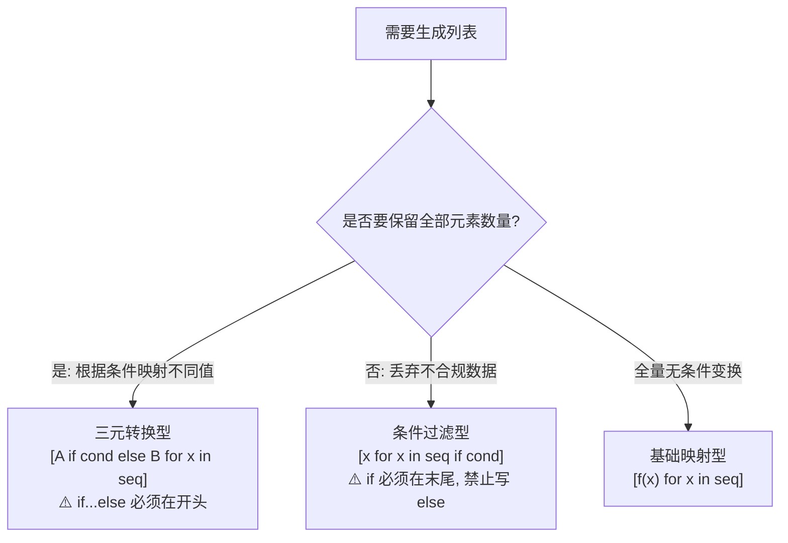

# 4.1.6 列表推导式语法与应用

[🏠 知识总索引](../00-INDEX.md) | [⬅️ 上一节：4.1.5 内置函数与高阶函数](04-内置函数与高阶函数.md) | [下一节：4.1.7 切片操作的强大功能 ➡️](06-切片操作全解.md)

---

> [!TIP]
> **30秒速记卡**
> - **三大核心骨架**：
>   1. 基础映射：`[表达式 for x in seq]`（前后长度一致）。
>   2. 过滤筛选：`[表达式 for x in seq if 条件]`（**`if` 在末尾，绝不带 `else`**，不满足直接丢弃）。
>   3. 分支转换：`[A if 条件 else B for x in seq]`（**三元在开头，必须带 `else`**，前后长度一致）。
> - **嵌套循环阅读法则**：`[x for row in matrix for x in row]` 顺序严格等于普通代码的从外到内（从左到右）。
> - **底层优势**：相比手动 `for` 循环 + `append()`，推导式在 C 语言层面优化，效率更高且更具 Pythonic 表现力。

**标签**：`#Python` `#列表推导式` `#语法糖` `#三元运算符` `#矩阵平铺`

---

## 一、核心结构决策矩阵



| 推导式形态 | 典型语法结构 | 作用机制 | 经典语法错误风险 |
| :--- | :--- | :--- | :--- |
| **基础映射** | `[x**2 for x in nums]` | 1对1处理，全量映射变换 | 漏写 `in` 或 `for` |
| **条件过滤** | `[x for x in nums if x > 0]` | 类似安检门，满足条件的留下，不满足的丢弃 | ⚠️ 误在末尾写 `else` 会报 `SyntaxError` |
| **条件分支** | `[x if x >= 60 else 'Fail' for x in nums]` | 类似流水线，每项必须产出值（二选一） | ⚠️ 误在开头省略 `else` 会报 `SyntaxError` |

---

## 二、多重循环与二维矩阵应用

### 1. 二维展开（列表平铺 Flatten）
语法书写顺序与多层普通 `for` 循环完全一致：
```python
matrix = [
    [1, 2, 3],
    [4, 5, 6]
]

# 展开为 [1, 2, 3, 4, 5, 6]
flat = [x for row in matrix for x in row]
```

等价于：
```python
flat = []
for row in matrix:      # 第 1 层
    for x in row:       # 第 2 层
        flat.append(x)
```

### 2. 生成嵌套矩阵（解决 `*` 浅拷贝问题）
```python
# 生成 3 行 4 列的全 0 矩阵，每行都是独立对象
matrix = [[0 for _ in range(4)] for _ in range(3)]
matrix[0][0] = 99
print(matrix[1][0])  # 依然是 0，各行完全独立！
```

---

## 三、易错避坑表

| 错误代码 / 误区 | 产生的错误 | 纠正方案 |
| :--- | :--- | :--- |
| `[x for x in nums if x > 0 else 0]` | `SyntaxError: invalid syntax` | 末尾过滤不允许 `else`。二选一转换改写为：`[x if x > 0 else 0 for x in nums]`。 |
| `[x if x > 0 for x in nums]` | `SyntaxError: expected 'else' after 'if' expression` | 开头三元表达式必须成对出现，补充 `else 默认值`。 |
| 对海量数据（如千万级）用推导式 `[x for x in range(10**7)]` | 瞬间内存暴涨甚至触发 MemoryError | 海量流式处理改用圆括号生成器表达式：`(x for x in range(10**7))`。 |
