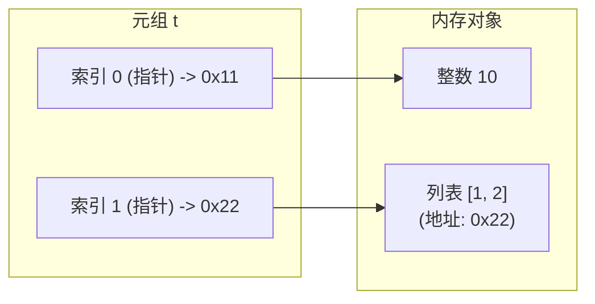

# 4.2 元组与生成器推导式

[🏠 知识总索引](../00-INDEX.md) | [⬅️ 上一节：4.1.7 切片操作全解](06-切片操作全解.md) | [下一节：4.3 字典全解与字典推导式 ➡️](08-字典全解与字典推导式.md)

---

> [!TIP]
> **30秒速记卡**
> - **元组特性**：有序、不可变（Immutable）序列。相比列表，内存占用小 20%~30%，访问速度快，可充当字典的键（Key）。
> - **单元素逗号陷阱**：`(42)` 是 `int`；只有加逗号的 `(42,)` 才是单元素元组！
> - **不可变性的本质**：元组锁死的是**内存地址指针**；若内部嵌套了列表等可变对象，修改列表内容（如 `t[1].append(4)`）完全合法！
> - **推导式特例**：圆括号推导式 `(x for x in ...)` **不是元组推导式**，而是**生成器推导式**（惰性求值、$O(1)$ 内存、一次性消耗）。若要生成元组需显式使用 `tuple()`。

**标签**：`#Python` `#元组` `#不可变性` `#指针引用` `#生成器推导式` `#惰性求值`

---

## 一、元组与列表核心维度对比

| 维度 | 列表 `list` | 元组 `tuple` |
| :--- | :--- | :--- |
| **可变性** | 可变（可原地增删改） | **不可变（创建后元素指针不可变）** |
| **字面量表示** | 中括号 `[1, 2, 3]` | 小括号 `(1, 2, 3)` 或逗号 `1, 2, 3` |
| **单元素表示** | `[1]` | **`(1,)`（必须带逗号）** |
| **内存与性能** | 动态扩容，预留冗余空间，稍慢 | **静态分配，紧凑紧凑，更快更省内存** |
| **可哈希性（作为 dict 的 key）** | 绝对不可作为 Key | **可作为 Key（前提是内部元素全为不可变类型）** |
| **数据安全性** | 适合动态收集数据 | 适合做只读配置、多线程共享只读数据、函数多返回值 |

---

## 二、关键考点与机制深度剖析

### 1. 不可变性的相对性（指针只读 vs 内部可变）



```python
t = (10, [1, 2])

# 试图修改指针 -> 报错
# t[0] = 20        # TypeError: 'tuple' object does not support item assignment
# t[1] = [3, 4]    # TypeError

# 沿着指针修改列表内部 -> 合法！
t[1].append(3)
print(t)           # (10, [1, 2, 3]) -> 元组指针没变，但列表内容变了
```

### 2. 生成器推导式 vs 列表推导式

```python
# 1. 列表推导式：贪婪求值，立刻分配大内存
lst = [x for x in range(1000000)]  # 耗费几十兆内存

# 2. 生成器推导式：惰性求值，仅生成待命迭代器
gen = (x for x in range(1000000))  # 仅耗费几十字节
print(type(gen))  # <class 'generator'>

# 生成器的一次性消耗特征
g = (x for x in range(3))
print(list(g))  # [0, 1, 2]
print(list(g))  # [] (已耗尽，不可重复使用)
```

---

## 三、易错避坑表

| 经典错误场景 | 错误表现 | 根因与规避方案 |
| :--- | :--- | :--- |
| `t = (1)` 以为是元组 | `type(t)` 为 `int` | 小括号被当作算术运算符。单元素元组必须写 `t = (1,)`。 |
| `t = (x for x in range(5))` 以为是元组 | `t` 是 `<generator object>` | Python 不存在原生元组推导式。必须外套 `tuple()`：`tuple(x for x in range(5))`。 |
| `d = {(1, [2]): 'val'}` | 报 `TypeError: unhashable type: 'list'` | 元组包含可变对象时失去可哈希性。做字典 Key 时元组内部必须全为不可变类型：`d = {(1, (2,)): 'val'}`。 |
