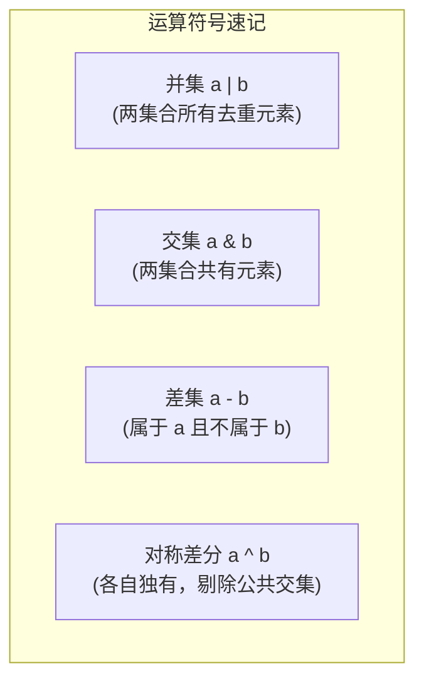

# 4.4 集合与数学集合运算

[🏠 知识总索引](../00-INDEX.md) | [⬅️ 上一节：4.3 字典全解与字典推导式](08-字典全解与字典推导式.md) | [下一节：4.5 序列解包 ➡️](10-序列解包.md)

---

> [!TIP]
> **30秒速记卡**
> - **集合本质**：无序、元素唯一、仅存 Key 的哈希表。查找与去重效率为 $O(1)$。
> - **无序性约束**：**不支持下标切片访问**（`s[0]` 抛 `TypeError`）。
> - **空集创建陷阱**：`{}` 是空字典！**空集合必须写成 `set()`**。
> - **删除对比**：`s.remove(x)` 元素不存在抛 `KeyError`；**`s.discard(x)` 优雅容错，不存在也绝不报错**。
> - **数学运算四剑客**：并集 `|`（合体）、交集 `&`（重叠）、差集 `-`（减去共有）、对称差分 `^`（非共有部分）。

**标签**：`#Python` `#集合` `#去重` `#discard` `#集合运算` `#交集并集差集`

---

## 一、集合核心特性与运算矩阵

### 1. 基础特性对比

| 特性 | 行为表现 | 违背后的报错 |
| :--- | :--- | :--- |
| **自动去重** | 重复添加同一元素自动忽略 | 无报错，自动静默去重 |
| **元素可哈希** | 只能存放不可变类型（数值、字符串、元组） | 放入列表或字典报 `TypeError: unhashable type` |
| **无序性** | 元素无固定下标顺序 | 使用 `s[0]` 报 `TypeError: 'set' object is not subscriptable` |

---

## 二、数学集合运算与符号速查

| 运算名称 | 运算符 | 方法形式 | 示例（`a={1, 2}, b={2, 3}`） | 结果 |
| :--- | :--- | :--- | :--- | :--- |
| **并集 (Union)** | `a \| b` | `a.union(b)` | `{1, 2} \| {2, 3}` | `{1, 2, 3}` |
| **交集 (Intersection)** | `a & b` | `a.intersection(b)` | `{1, 2} & {2, 3}` | `{2}` |
| **差集 (Difference)** | `a - b` | `a.difference(b)` | `{1, 2} - {2, 3}` | `{1}` |
| **对称差分 (Symmetric Diff)** | `a ^ b` | `a.symmetric_difference(b)` | `{1, 2} ^ {2, 3}` | `{1, 3}` |

---

## 三、常用修改方法

- `s.add(elem)`：向集合添加单个元素。
- `s.update(iter)`：批量合并可迭代对象（列表、元组、字符串等均可）。
- `s.discard(elem)`：**安全删除指定元素**。若元素不存在，静默跳过，**极力推荐在工程代码中使用**。
- `s.remove(elem)`：严格删除。若元素不存在，抛出 `KeyError`。
- `s.pop()`：随机弹出一个元素并返回（空集合时抛 `KeyError`）。

---

## 四、易错避坑表

| 经典误区 | 产生的错误 | 避坑指引 |
| :--- | :--- | :--- |
| `s = {}` 误以为是空集合 | `type(s)` 实际为 `dict` | 必须显式写 `s = set()`。 |
| `s.remove('not_in')` | 抛出 `KeyError` 导致异常中断 | 优先改用 `s.discard('not_in')`，或先判断 `if x in s:`。 |
| 对集合做切片 `s[:2]` | 抛出 `TypeError: 'set' object is not subscriptable` | 集合无序无下标，如需切片需先转为列表：`list(s)[:2]`。 |
