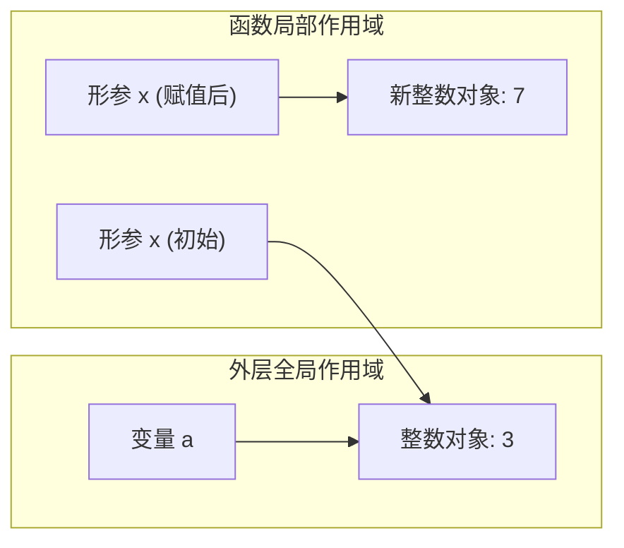

# 5.1 函数定义、调用与形参实参机制

[🏠 知识总索引](../00-INDEX.md) | [下一节：5.2 函数参数机制全解 ➡️](02-函数参数机制全解.md)

---

> [!TIP]
> **30秒速记卡**
> - **函数三要素**：函数名（标识符）、参数列表（输入数据通道，可选）、返回值（输出结果通道，可选）。
> - **一等公民本质**：`def` 是一条动态执行语句，运行时创建 `function` 类型的对象，函数名本质是持有该对象引用的变量。
> - **形参 vs 实参**：形参是定义函数时局部命名空间的“占位标签”；实参是调用函数时传入的“真实对象”。
> - **传对象引用（Pass-by-Object-Reference）**：调用时将实参对象的引用赋给形参。对不可变对象形参重新赋值（如 `x = x + 1`），仅改变局部标签指向，**绝不影响外部实参**。
> - **返回值铁律**：函数未执行 `return` 或单纯执行空 `return` 时，默认返回 `None`；`print()` 仅输出至终端，不提供返回值。

**标签**：`#Python` `#函数定义` `#形参实参` `#引用传递` `#返回值` `#None`

---

## 一、函数语法与核心三要素

```python
def function_name(arg1, arg2, ...):
    """【可选】文档字符串 docstring：描述函数功能与参数说明"""
    statement_1
    statement_2
    return return_value  # 【可选】返回值，未显式声明则默认 return None
```

| 要素 | 核心规则 | 易错陷阱 |
| :--- | :--- | :--- |
| **函数名** | 字母或下划线开头，支持字母/数字/下划线组合；区分大小写；遵循蛇形命名（如 `calculate_score`）。 | 不能是 Python 保留关键字；不能与内置函数重名（如避免命名为 `sum`、`list`、`max`）。 |
| **形参列表** | 括号不可省略，无论是否有参数；形参属于函数执行时的局部命名空间。 | 仅在被调用时由实参对象初始化，函数外部无法访问形参。 |
| **返回值** | `return` 负责终结函数执行并向调用者交付数据；支持返回任意类型数据。 | 误把 `print()` 当做返回值；无 `return` 的函数返回 `None`。 |

---

## 二、底层心智模型与执行机制

### 1. 函数对象的“一等公民”模型
在 Python 中，一切皆对象。`def` 语句在执行时，在堆内存中实例化出一个函数对象，并将其地址绑定到函数名：

```python
def greet():
    return "Hello"

# 函数名只是一个普通的变量标签！
say = greet
print(say())  # 输出 "Hello"
print(type(greet))  # <class 'function'>
```

### 2. 形参与实参的引用解耦模型
调用函数时，Python 采用 **传对象引用（Call-by-Object-Reference / Pass-by-Assignment）** 机制：



- **初始状态**：实参 `a` 指向对象 `3`，调用时形参 `x` 同样指向 `3`。
- **重绑定操作**：函数内执行 `x = x + y` 时，生成新整数对象 `7`，并将局部标签 `x` 重新指向 `7`。
- **作用域隔离**：外层的变量 `a` 依然指向 `3`，函数返回后局部标签 `x` 销毁，`a` 保持不变。

---

## 三、高频避坑指南

### 1. `print()` 与 `return` 混淆陷阱
- `print(*args)`：只负责在标准输出（屏幕）上打印文本，其自身的返回值是 `None`。
- `return value`：用于从函数退出并把值赋给调用点接收的变量。

```python
def add(a, b):
    print(a + b)

res = add(1, 2)  # 终端输出: 3
print(res)       # 终端输出: None！因为 add 没有 return
```

### 2. 局部变量在外部不可见
形参和函数体内创建的变量属于局部命名空间（Local Namespace），随着函数调用结束栈帧被弹出销毁，外部尝试访问会直接抛出 `NameError`。
