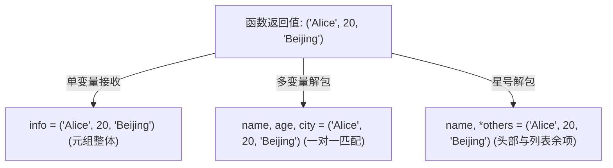

# 5.3 函数返回值机制

[🏠 知识总索引](../00-INDEX.md) | [⬅️ 上一节：5.2 函数参数机制全解](02-函数参数机制全解.md) | [下一节：5.4 变量作用域与LEGB规则 ➡️](04-变量作用域与LEGB规则.md)

---

> [!TIP]
> **30秒速记卡**
> - **`return` 的双重行为**：立即截断执行（后续语句变为不可达代码），并将指定对象交还给调用者。
> - **默认返回值铁律**：函数未写 `return`，或仅写孤立的 `return`（无表达式），一律返回 `None`。
> - **“多返回值”本质**：Python 虚拟层**永远只返回单一对象**。语法上 `return a, b` 是逗号触发的**隐式元组打包（Tuple Packing）**，返回的是一个 `tuple`。
> - **接收模式**：
>   - 单变量接收整个元组：`res = func()`；
>   - 序列解包精准接收：`x, y = func()`，可配合星号解包 `first, *rest = func()`。

**标签**：`#Python` `#函数返回值` `#return` `#None` `#元组打包` `#序列解包`

---

## 一、`return` 的执行语义与返回值形态

```python
def function_demo():
    # ...
    return expr1, expr2  # 本质返回 (expr1, expr2)
    # 此处及后续代码全部不可达！
```

### 1. 返回值类型矩阵

| 返回语句形式 | 返回对象类型 | 实际拿到值 | 典型用途 |
| :--- | :--- | :--- | :--- |
| **不写 `return`** | `NoneType` | `None` | 纯过程式操作（如日志打印、数据原地修改）。 |
| **裸 `return`** | `NoneType` | `None` | 提前中断函数执行（Guard 卫语句）。 |
| **`return x`** | 任意类型 | `x` 的值 | 返回单一计算结果。 |
| **`return a, b, ...`** | **`tuple`** | `(a, b, ...)` | 同时交付多项关联数据（隐式元组封装）。 |

---

## 二、底层真相：隐式元组打包与解包接收

### 1. 多返回值的底层包装
Python 语法允许在 `return` 后面用逗号分隔多个表达式：
```python
def get_user():
    return 'Alice', 20, 'Beijing'

info = get_user()
print(type(info))  # <class 'tuple'>
print(info)        # ('Alice', 20, 'Beijing')
```
底层等价于显式构建元组：`return ('Alice', 20, 'Beijing')`。

### 2. 调用方接收范式对比



```python
# 1. 单变量打包接收
tup = get_user()
print(tup[0])  # 'Alice'

# 2. 序列解包接收（推荐：直观高效）
name, age, city = get_user()
print(name, age, city)  # 'Alice' 20 'Beijing'

# 3. 带星号解包接收（结合 4.5 节知识）
name, *details = get_user()
# name 为 'Alice', details 为 [20, 'Beijing']（带 * 必为 list）
```

---

## 三、高频易错与设计模式

### 1. 易错辨析：裸 `return` 返回什么？
- 常见误区：以为裸 `return` 返回空元组 `()`。
- 正确事实：裸 `return` 严格返回 `None`。只有显式写 `return ()` 才会返回空元组。

### 2. 卫语句（Guard Clause）提前返回模式
通过 `return` 提前阻断异常与边界分支，避免深层 `if-else` 嵌套：
```python
def process_data(data):
    # 卫语句：优先拦截非法或空边界
    if not data:
        return None
    
    # 核心业务逻辑平铺展开，无深层缩进
    processed = [x * 2 for x in data]
    return min(processed), max(processed)
```
