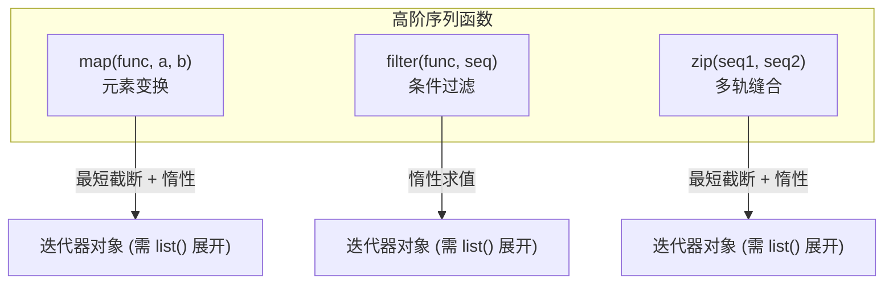

# 5.6 常用内置函数与高阶序列操作

[🏠 知识总索引](../00-INDEX.md) | [⬅️ 上一节：5.5 匿名函数与 lambda 表达式](05-匿名函数与lambda表达式.md) | [下一节：5.7 函数高级主题（嵌套闭包/递归/生成器） ➡️](07-函数高级主题.md)

---

> [!TIP]
> **30秒速记卡**
> - **数学与检测工具**：
>   - `abs(x)`：数值求绝对值，复数求模长 $\sqrt{a^2+b^2}$；
>   - `divmod(a, b)`：一步返回 `(商, 余数)` 元组；
>   - `pow(x, y, z)`：高效模幂 $(x^y) \pmod z$；
>   - `callable(obj)` / `isinstance(obj, types)`：可调用性检查与多类型联合判断。
> - **高阶序列操作三剑客**（均具**惰性求值**特性，需 `list()` 展开）：
>   - **`map(f, *iters)`**：批量映射，多序列按**最短长度截断**；
>   - **`filter(f, iter)`**：真值过滤，仅保留 `bool(f(x)) is True` 的元素；
>   - **`zip(*iters)`**：多序列对齐缝合为元组，按**最短长度截断**。

**标签**：`#Python` `#内置函数` `#map` `#filter` `#zip` `#高阶函数` `#惰性求值`

---

## 一、高频数值与类型检测内置函数

| 函数签名 | 核心行为 | 经典示例 / 返回值 |
| :--- | :--- | :--- |
| `abs(x)` | 绝对值；若传入复数返回其模 | `abs(-10) -> 10`<br>`abs(3+4j) -> 5.0` |
| `divmod(a, b)` | 返回元组 `(a // b, a % b)` | `divmod(17, 5) -> (3, 2)` |
| `pow(x, y [, z])` | $x^y$ 或 $(x^y) \pmod z$ | `pow(2, 3, 5) -> 3` |
| `round(x [, n])` | 四舍五入到 $n$ 位小数 | `round(2.675, 2) -> 2.67` |
| `callable(obj)` | 判断对象是否可加括号调用 | `callable(len) -> True`<br>`callable(10) -> False` |
| `isinstance(o, t)`| 检测对象类型，支持元组类型集 | `isinstance(3, (int, float)) -> True` |

---

## 二、高阶序列操作三剑客深度剖析



### 1. `map(function, *iterables)` —— 并行映射
- 若传入多个序列，各序列对应位置元素同时传入 `function`；
- **最短截断法则**：当序列长度不一时，一旦最短的序列耗尽，立刻终止。

```python
a = [1, 2, 3, 4]
b = [10, 20, 30]
print(list(map(lambda x, y: x + y, a, b)))
# 输出: [11, 22, 33] (元素 4 被舍弃)
```

### 2. `filter(function, iterable)` —— 条件筛选
- 仅保留 `function(item)` 为真（Truthy）的元素；若 `function` 传 `None`，则自动剔除所有假值元素（`0`, `''`, `[]`, `None` 等）。

```python
data = [0, 1, False, 2, '', 3, 'hello']
print(list(filter(None, data)))  # [1, 2, 3, 'hello']
```

### 3. `zip(*iterables)` —— 并行配对
- 将多序列对应下标元素打包为元组；按最短序列截断。
- **经典技巧（矩阵转置与字典反转）**：
  ```python
  # 矩阵转置
  matrix = [[1, 2, 3], [4, 5, 6]]
  transposed = [list(row) for row in zip(*matrix)]
  # [[1, 4], [2, 5], [3, 6]]

  # 两个列表快速构建字典
  keys = ['name', 'age']
  vals = ['Alice', 20]
  user = dict(zip(keys, vals))
  # {'name': 'Alice', 'age': 20}
  ```
