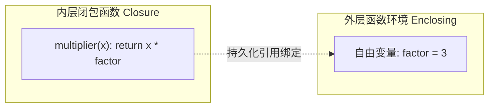

# 5.7 函数高级主题（闭包、递归与生成器函数）

[🏠 知识总索引](../00-INDEX.md) | [⬅️ 上一节：5.6 常用内置函数与高阶序列操作](06-常用内置函数与高阶序列操作.md)

---

> [!TIP]
> **30秒速记卡**
> - **闭包（Closure）**：内层嵌套函数打包随身携带外层函数的环境变量（自由变量），外层函数退出后状态依然常驻堆内存。
> - **递归函数（Recursion）**：内部调用自身；必须具备**基准出口（Base Case）**与**递归步（Recursive Step）**，缺失出口会导致 `RecursionError` 栈溢出。
> - **生成器“随身听”心智模型**：
>   - 包含 `yield` 的函数是生成器函数；
>   - **实例化不执行**：`g = gen()` 仅创建生成器对象，**函数体一行都不执行**（不按播放键绝不发声）；
>   - **`next()` 才唤醒**：首次执行 `next(g)` 启动函数，遇到 `yield` **吐出数据并立即挂起暂停（Freeze）**；
>   - **再次 `next()` 恢复**：从上次暂停点继续向下执行，耗尽后抛出 `StopIteration`；
>   - **`yield from`**：自动展开并委托遍历子迭代对象。

**标签**：`#Python` `#闭包` `#递归` `#生成器` `#yield` `#next` `#StopIteration` `#惰性求值`

---

## 一、函数嵌套与闭包（Closure）



- **核心价值**：避免使用全局变量，实现数据的轻量级私有封装与持久化状态保持。
```python
def make_multiplier(factor):
    def multiplier(x):
        return x * factor  # 闭包捕获自由变量 factor
    return multiplier

triple = make_multiplier(3)
print(triple(10))  # 30 (外层已退出，但 factor=3 依然常驻)
```

---

## 二、函数递归（Recursion）

实现递归必须满足的两大支柱：

| 支柱 | 职责 | 缺失后果 |
| :--- | :--- | :--- |
| **1. 基准出口 (Base Case)** | 识别最简单直接的解，无须再向下递归，直接返回确定值。 | 无限递归压栈，导致 `RecursionError: maximum recursion depth exceeded`。 |
| **2. 递归步 (Recursive Step)** | 将规模为 $n$ 的问题转化为规模为 $n-1$（或更小）的同类子问题，必须单调逼近出口。 | 逻辑死循环，无法触底反弹。 |

```python
def factorial(n):
    if n == 1:             # ① 递归基准出口
        return 1
    return n * factorial(n - 1)  # ② 递归步
```

---

## 三、生成器函数与 `yield` 工作机制（重难点）

### 1. `yield` 与 `return` 的本质分水岭
- `return`：终结函数，销毁栈帧，返回值。
- `yield`：**暂停（Pause/Freeze）当前函数**，将结果交出给外部，并**封存保存当前所有局部变量和执行指针**。

### 2. 随身听心智模型与执行生命周期

```
代码动作                   底层状态                     输出/行为
g = my_gen()        ──>   买回随身听，未按播放键   ──>   函数体一行都不跑！
val = next(g)       ──>   按播放键 ▶ 运行到 yield ──>   打印语句，交出值，立即挂起 ⏸
val = next(g)       ──>   再次按播放键 ▶ 恢复执行  ──>   从暂停处继续跑向下一 yield
遍历耗尽            ──>   磁带播放完毕             ──>   触发 StopIteration 终结
```

```python
def count_down(n):
    print("Start")
    while n > 0:
        yield n
        n -= 1
    print("End")

g = count_down(2)   # 此时完全不打印！函数未启动
print(next(g))      # 打印 "Start"，遇到 yield 2 挂起，输出 2
print(next(g))      # 从 yield 后恢复，n 减为 1，遇到 yield 1 挂起，输出 1
# 再次 next(g) 会打印 "End"，然后抛出 StopIteration 异常
```

### 3. `yield from` 委托语法
用于扁平化展开可迭代对象或嵌套生成器：
```python
def chain_iter():
    yield from 'ABC'  # 等价于 for ch in 'ABC': yield ch

print(list(chain_iter()))  # ['A', 'B', 'C']
```
