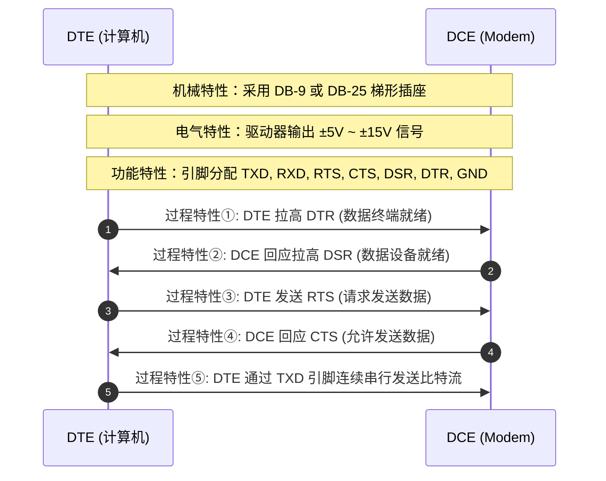

# 01-物理层的基本概念与四大特性

[🏠 知识总索引](../00-INDEX.md) | [⬅️ 上一章：05-网络体系结构与分层](../ch01-overview/05-计算机网络体系结构与分层.md) | [下一节：02-数据通信的基础知识 ➡️](./02-数据通信的基础知识.md)

---

## ⚡ 30 秒核心速查卡

| 核心考点 | 记忆口诀 / 关键判据 | 典型实例 |
| :--- | :--- | :--- |
| **物理层的核心定位** | **传输比特流，屏蔽媒体差异**（传输介质在物理层之下） | 物理层向链路层提供透明比特传输服务 |
| **通信交互模型** | **DTE（终端/源宿）与 DCE（电路终结/适配转换）** | 计算机/路由器为 DTE；调制解调器/光猫为 DCE |
| **机械特性** | **“长什么样、插不插得进”** | 引脚数目（8针）、插头尺寸、引脚排列间距 |
| **电气特性** | **“电压多高、电平代表啥”** | 电平范围（-3V~-15V为逻辑1）、阻抗匹配、传输速率上限 |
| **功能特性** | **“这根引脚具体是干什么的”** | 规定引脚1为 TXD（发送）、引脚2为 RXD（接收）、引脚7为 GND |
| **过程特性** | **“先干什么、后干什么的时序”** | 建立连接时 DTE 置 RTS 有效 $\to$ DCE 置 CTS 有效 $\to$ 发送数据 |

**🏷️ 标签 Tags**：`物理层` `四大特性` `DTE/DCE` `机械特性` `电气特性` `功能特性` `过程特性` `透明传输`

---

## 一、物理层的本质任务与核心定位

### 1.1 为什么需要物理层？（背景与痛点）
现代计算机网络连接着种类极其繁多的实体硬件与通信手段：
- 传输媒体有铜线（双绞线、同轴电缆）、光纤、无线电磁波（微波、红外、卫星）；
- 接插件有 RJ-45、光纤接口（SC/LC/FC）、同轴电缆 BNC 头；
- 物理信号有高低电平、光脉冲的明暗、电磁波的相位调制。

如果让上层协议（如数据链路层、网络层）直接面向这些各异的物理细节编程，一旦介质由网线换成光纤，上层软件全部需要重写。

### 1.2 物理层的定义
> **物理层（Physical Layer）**：在连接各种计算机的传输媒体之上，**屏蔽物理设备、传输媒体和通信手段的差异**，为数据链路层提供**透明传输比特流（Bit Stream）**的服务。

```
+-----------------------------------------------------------+
|                      数据链路层                            |
+-----------------------------------------------------------+
                             ↕ (透明交付比特流，无视底层传输硬件)
+-----------------------------------------------------------+
|  物理层：规定 DTE 与 DCE 之间的接口标准 (四大特性)             |
+-----------------------------------------------------------+
                             ↕ (电平/光脉冲信号驱动)
~~~~~~~~~~~~ 传输媒体（铜缆/光纤/无线电波，属于物理层之下） ~~~~~~~~~~~~
```

> [!IMPORTANT]
> **关键边界：传输媒体不属于物理层！**
> 传输媒体（如双绞线、同轴电缆、光纤、无线信道）常被称为**第 0 层**。
> 物理层规定的是信号与接口的规范标准，而不是具体的导线物质本身。

---

## 二、通信交互模型：DTE 与 DCE

在物理层通信标准中，任何一段物理通信链路的两端通常都可以划分为两类角色：

```
+---------------+        +---------------+                   +---------------+        +---------------+
|   DTE (主机)   | <----> |  DCE (Modem)  | ~~~ 物理信道 ~~~ |  DCE (Modem)  | <----> |   DTE (主机)   |
+---------------+        +---------------+                   +---------------+        +---------------+
        \_______________________/                                   \_______________________/
             物理层接口规范                                               物理层接口规范
```

- **DTE（Data Terminal Equipment，数据终端设备）**：
  - 数据的**源点（Source）**或**终点（Sink）**。
  - 包含用户数据处理能力。典型设备：计算机、终端机、打印机、路由器的以太网接口。
- **DCE（Data Circuit-terminating Equipment，数据电路终结设备 / 数据通信设备）**：
  - 为 DTE 提供入网连接的适配与信号转换设备。
  - 负责信号的调制解调、编码转换、时钟同步与电气电平适配。典型设备：Modem（调制解调器）、光猫（ONT）、网卡内部的 PHY 收发器芯片。
- **物理层协议的核心**：就是精确规范 **DTE 和 DCE 之间这组连接电缆与接口的标准**。

---

## 三、物理层接口四大特性（核心考点）

为确保不同厂商生产的 DTE 与 DCE 设备能够完美互联互通，物理层协议必须规定以下四大特性：

### 3.1 四大特性对比矩阵

| 特性名称 | 规范的核心要素 | 考题辨析关键词 | 经典现实标准实例 |
| :--- | :--- | :--- | :--- |
| **机械特性**<br>*(Mechanical)* | 接插件的规格尺寸、引脚针脚数目、排列形状、公母头锁扣结构等 | 引脚数、间距、针孔、长宽高、形状 | RJ-45（8 芯、插头卡扣、针距 1.02 mm）；DB-9、DB-25 梯形针座 |
| **电气特性**<br>*(Electrical)* | 传输信号线上的**电压范围**、阻抗匹配、最大传输距离、最高传输速率等量化物理量 | 电压值、电平范围、伏特(V)、传输距离(m)、欧姆($\Omega$) | EIA-232 规定逻辑 0 为 $+3\text{V}\sim +15\text{V}$，逻辑 1 为 $-3\text{V}\sim -15\text{V}$；双绞线阻抗 $100\,\Omega$ |
| **功能特性**<br>*(Functional)* | 某条线上出现的某一电平的**物理含义与语义**、各引脚的特定功能分配 | 含义、定义、用途、发送线、接收线、接地线 | 规定引脚 2 为发送数据（TXD）、引脚 3 为接收数据（RXD）、引脚 5 为信号地（SG） |
| **过程特性 / 规程特性**<br>*(Procedural)* | 指明对于不同功能的各种可能事件出现的**先后时序、操作步骤与状态转换** | 步骤、顺序、先...后...、建立连接时序 | DTE 先使 RTS 有效 $\to$ DCE 检测后置 CTS 有效 $\to$ DTE 开始发送数据 $\to$ 发送完毕取消 RTS |

### 3.2 深度拆解与实例对比（以 EIA-232 / RS-232 为例）



---

## 四、易错避坑与真题套路

| 序号 | 常见混淆坑点 | 避坑分析与核心秘籍 |
| :---: | :--- | :--- |
| **1** | **“接口引脚数量” vs “引脚功能分配”** | 规定接插件有几根针脚是**机械特性**；给针脚分配定义（如“第 3 针是接收线”）是**功能特性**。 |
| **2** | **“信号电平伏特数” vs “信号电平代表的含义”** | 规定 $-5\text{V}\sim -15\text{V}$ 是**电气特性**；规定“高电平代表请求发送，低电平代表无请求”是**功能特性**。 |
| **3** | **“物理层包含光纤网线”** | 物理层是五层模型中的第一层，规定的是接口标准与信号时序，**传输媒体属于物理层之下**，不能归于物理层内部。 |
| **4** | **“过程特性与协议三要素中的同步”** | 过程特性在概念上直接对应协议三要素中的**同步（时序关系）**；功能特性对应**语义**。 |
